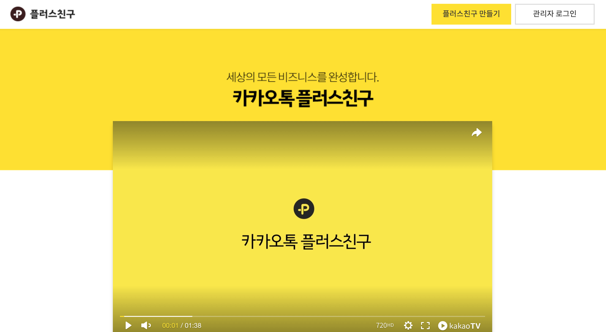
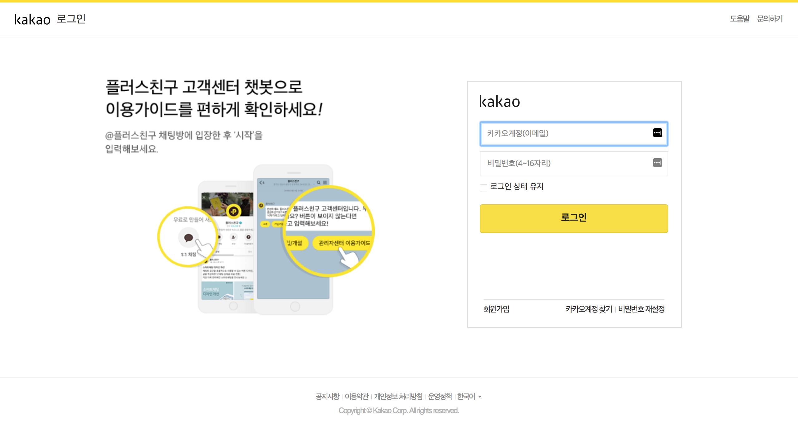
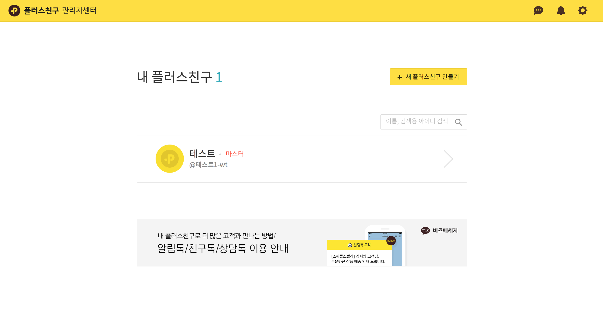
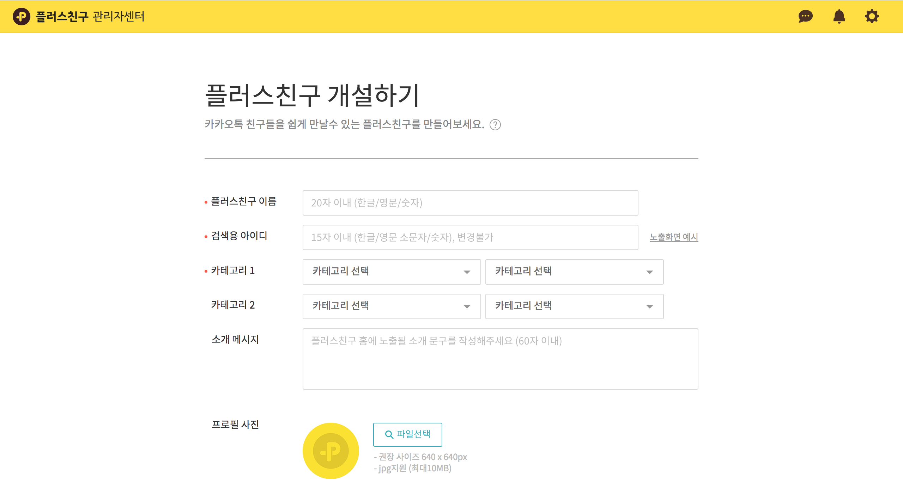
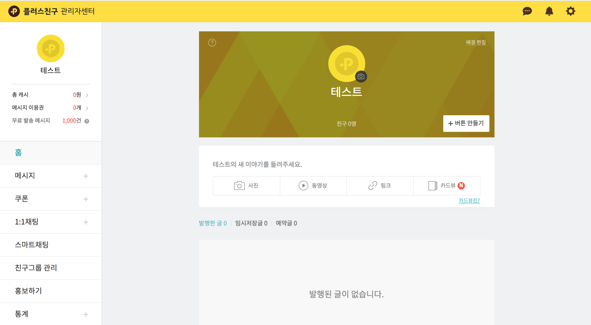
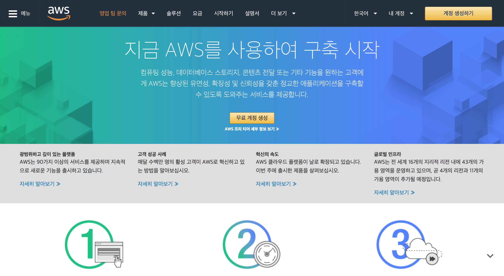
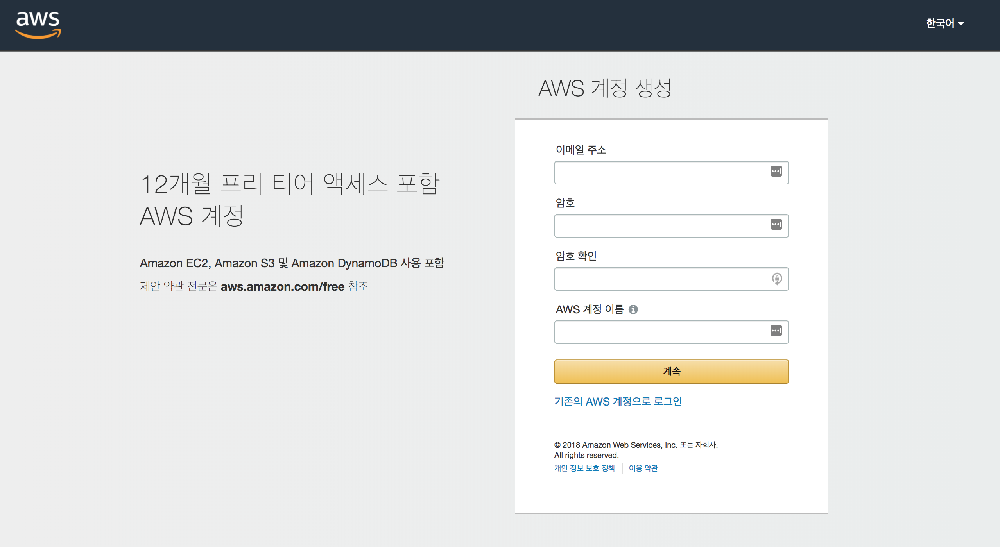
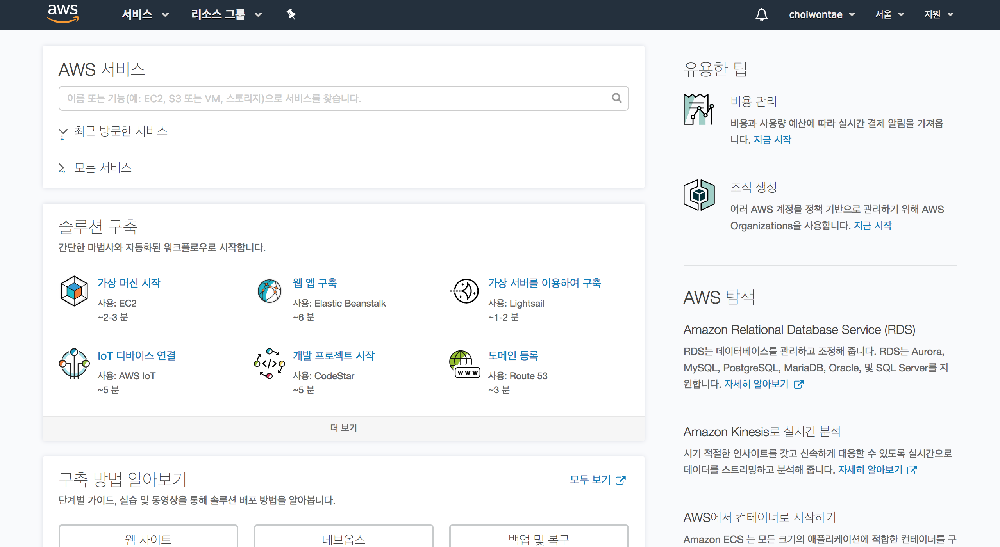

#카카오톡 채팅 봇 만들기 #1
서론
--

저는 외국에서 대학교를 다니는데 얼마 전인 4월 말에 학기가 끝났습니다.
9월까지 길고 긴 방학동안 무엇을 해볼까 곰곰히 생각하던 중 간단하더라도 아무거나 만들어 봐야겠다는 생각이 들었습니다.
그러던 중 카카오톡 자동 채팅 플러스 친구를 만들고 싶다는 생각이 들었습니다.
궁극적으로 원하는 카카오톡 채팅 봇은 제가 다니는 학교의 정보를 제공해주는 플러스 친구이지만 일단 간단한 채팅 주고 받음을 할 수 있는 채팅봇을 먼저 만들어 보겠습니다.

어떻게 시작해야하는지 열심히 구글링 한 뒤 저는 **Java** 와 [AWS](https://aws.amazon.com/) (Amazon Web Services)를 사용하여 만들어 보기로 하였습니다.  AWS가 필요한 이유는 바로 카카오톡 채팅 API을 사용하여 채팅봇을 만들기 위해선 *서버* 가 필요하기 때문입니다.[아마존 웹 서비스](https://aws.amazon.com/)에서는 가입을 하게 되면 1년동안 무료로 서버를 제공해줍니다. 저는 이 서비스를 이용하여 카카오톡 채팅 봇을 만들어 보겠습니다.

카카오톡 셋업하기
-------------
일단 본격적인 코딩에 앞서, 카카오톡 플러스 친구 관리자 사이트인 <https://center-pf.kakao.com/>로 접속을 하여 로그인을 합니다.

  

상단 오른쪽 부분에 **플러스친구 만들기** 를 누릅니다.  

본인의 카카오톡 아이디로 간편히 로그인합니다.

로그인 후 보시다시피 **내 플러스 친구** 화면이 나옵니다. 저는 미리 만들어 놓은 플러스 친구가 있는데 상단 오른쪽 부분 **새 플러스친구 만들기** 를 눌러 새로 만들어 보겠습니다.

입맛에 맞게 작성하시면 되겠습니다.
 
자 그러면! 나만의 플러스친구가 만들어졌습니다.

여기까지 일단 카카오톡 페이지에서 하시면 될 셋업입니다.

AWS 셋업하기
---------
이제 [AWS](https://aws.amazon.com/)에서 서버를 만들어 보겠습니다. **아마존 웹 서비스** 줄여서 AWS는 가입하면 무료로 1년동안 서버를 제공합니다. <https://aws.amazon.com/> 이 링크를 통해 **아마존 웹 서비스** 사이트에 들어가 봅니다.

상단 부분에 계정 생성하기를 합니다.

이 화면부터 차근차근 **아마존 웹 서비스** 계정을 만듭니다.

자 이 화면이 나오셨다면 계정 생성까지 완료하신 겁니다. 이제 여기서 서버를 구축하는 일만 남았습니다.
 
일단 여기서 **카카오톡 채팅 봇 만들기** 첫번째 포스팅을 마치겠습니다.
